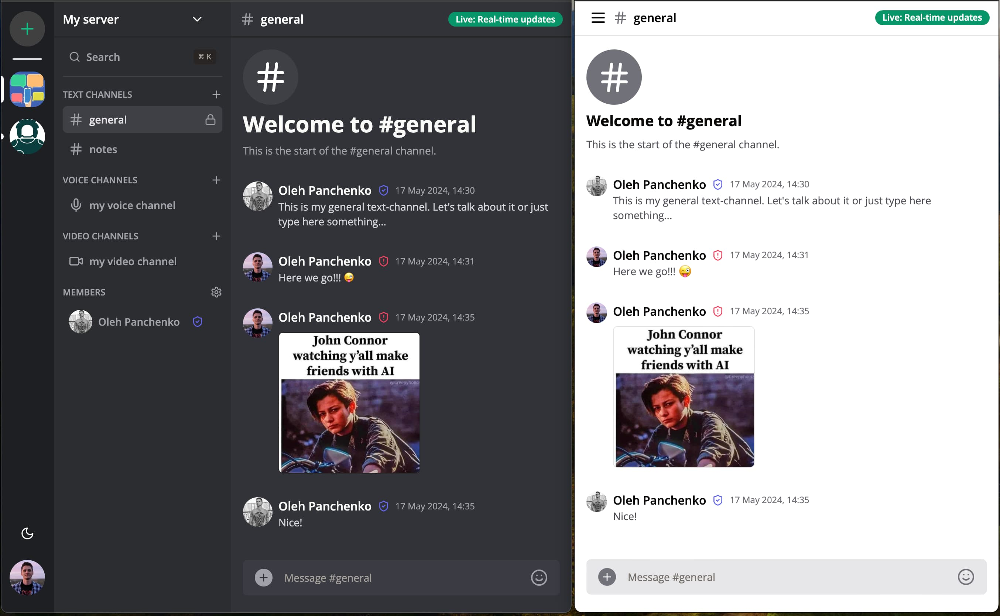

# Discord Clone App

**[VIEW DEMO](https://nextjs-discord-clone-production-f7d1.up.railway.app)**

---

## Project description

A real-time team chat application built on the base of Next.js, ShadcnUI components and Tailwind CSS using MySQL database and websockets.

### Features

- Responsive and mobile UI using [Tailwind CSS](https://tailwindcss.com/) and [ShadcnUI](https://ui.shadcn.com/) components library
- Light / Dark mode
- Authentication with [Clerk](https://clerk.com/)
- Object-Relational Mapping using [Prisma](https://www.prisma.io/)
- MySQL database using Aiven.io
- Server creation and customization
- Unique invite link generation & full working invite system
- Member management (Kick, Role change Guest / Moderator)
- Real-time messaging using [Socket.io](https://socket.io/)
- Websocket fallback: Polling with alerts
- Infinite loading for messages in batches of 10 (using [@tanstack/query](https://tanstack.com/query/latest))
- Send attachments as messages using [UploadThing](https://uploadthing.com/)
- Delete & Edit messages in real time for all users
- Create Text, Audio and Video call Channels
- 1:1 conversation between members
- 1:1 video calls between members in rooms with [LiveKit.io](https://livekit.io/) (**_in progress_**)

### Technologies

- Next.js
- React
- TypeScript
- Tailwind CSS
- Clerk
- Prisma
- MySQL
- Socket.io
- Uploadthing
- Next-themes
- Axios
- React-Query (v4)
- Query-String
- Zod
- React Hook Form
- Zustand
- Date-FNS
- Emoji Mart

... and more. Full list of dependencies and additional information is available in **`package.json`** file.
